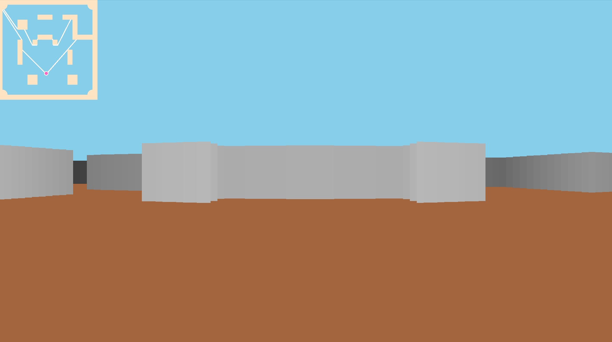
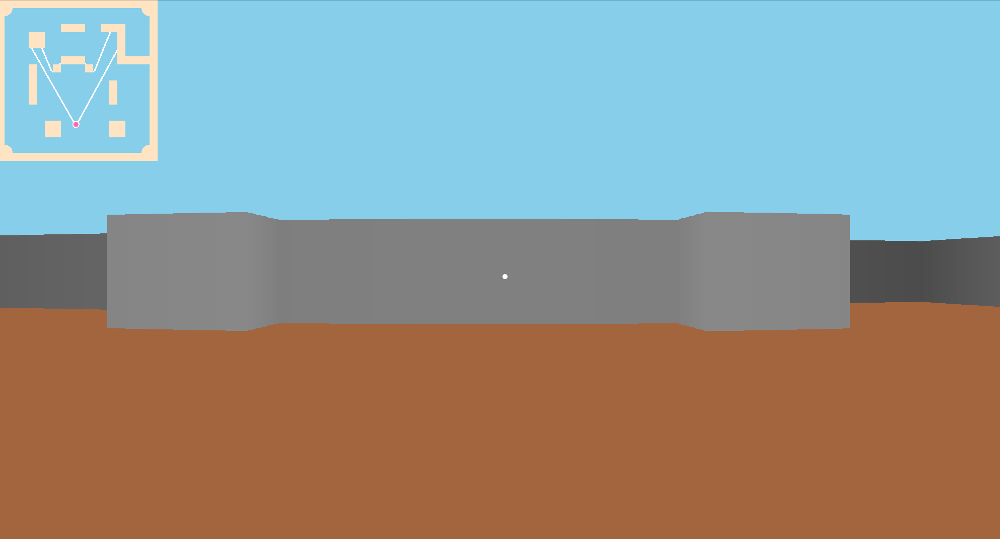
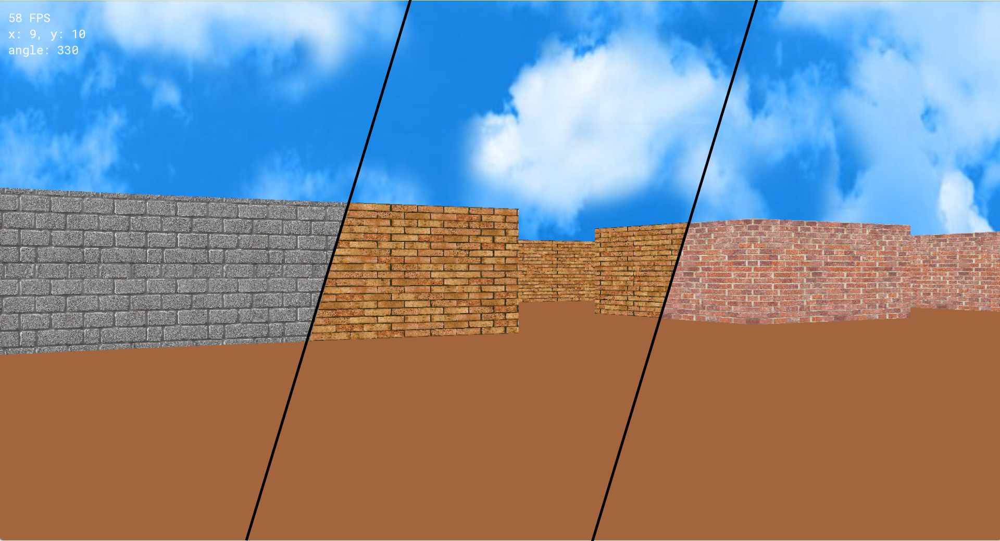

# Pseudo3DGame

Pseudo 3d implementation by c++ and sfml

[](http://choosealicense.com/licenses/mit/)


| 90 rays                        | 400 rays                        |
| -------------------------------|---------------------------------|
|   |    |

# Texturing



# Requirements
* C++ 20
* CMake 3.20
* SFML 2.5

# Building & Running
```
cmake -B cmake-build-release -DCMAKE_BUILD_TYPE=Release
cmake --build cmake-build-release
cmake --build cmake-build-release --target release
```

# Control
| Action               | Control         |
| ---------------------|-----------------|
| Move                 | WASD keys       |
| Rotation             | Mouse movement  |
| Exit                 | Q key           |
| Pause                | Esc             |
